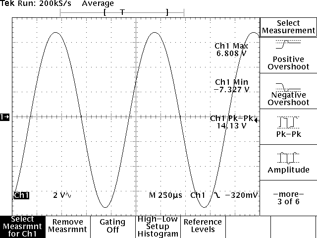

# TEKTRONIX-TDS-320
Program for downloading screenshots from TEKTRONIX TDS 320.

## Linux instalation:
  Require python3 or higher  
  install python library for serial communication  
  `sudo aptitude install python3-serial`  
  Run `./download.py` or `python3 download.py`

## Windows instalation:
  install python 3 or higher  
  `install python3+`  
  install python library for serial communication  
  `pip install pyserial`
  Run `python download.py`
